<h3><code>saksham@github ~ $ ./contributions.sh</code></h3>

  

<h3><code>saksham@github ~ $ whoami</code></h3>

<table>
  <tr>
    <td valign="top"></td>
    <td valign="top"></td>
  </tr>
</table>

 

<h3><code>saksham@github ~ $ ls ./projects</code></h3>

<table>
  <tr>
    <td><b><a href="https://github.com/sakshamfit/FRINKELs">FRINKELs</a></b></td>
    <td align="left">Hyperlocal social app — clean architecture, Supabase + Firebase.</td>
    <td><code>Dart</code> <code>Flutter</code></td>
  </tr>
  <tr>
    <td><b><a href="https://github.com/sakshamfit/NEARverse">NEARverse</a></b></td>
    <td align="left">The platform layer behind NEARconnect.</td>
    <td><code>Python</code> <code>JavaScript</code></td>
  </tr>
  <tr>
    <td><b><a href="https://github.com/sakshamfit/AI-Career-Studio">AI-Career-Studio</a></b></td>
    <td align="left">AI tooling for career workflows.</td>
    <td><code>Python</code></td>
  </tr>
  <tr>
    <td><b><a href="https://github.com/sakshamfit/jurisai-">jurisai</a></b></td>
    <td align="left">Legal-AI experiment, Postgres-backed.</td>
    <td><code>JavaScript</code> <code>PLpgSQL</code></td>
  </tr>
  <tr>
    <td><b><a href="https://github.com/sakshamfit/3d-portfolio">3d-portfolio</a></b></td>
    <td align="left">Portfolio site with a 3D front end.</td>
    <td><code>TypeScript</code> <code>CSS</code></td>
  </tr>
</table>

 

<h3><code>saksham@github ~ $ cat ./contact</code></h3>

  

<code>█</code> Everything above is a self-contained animated SVG, generated by the Python scripts in <a href="./scripts"><code>/scripts</code></a> and refreshed daily by a GitHub Action. No third-party stats services, no token, no JavaScript.

